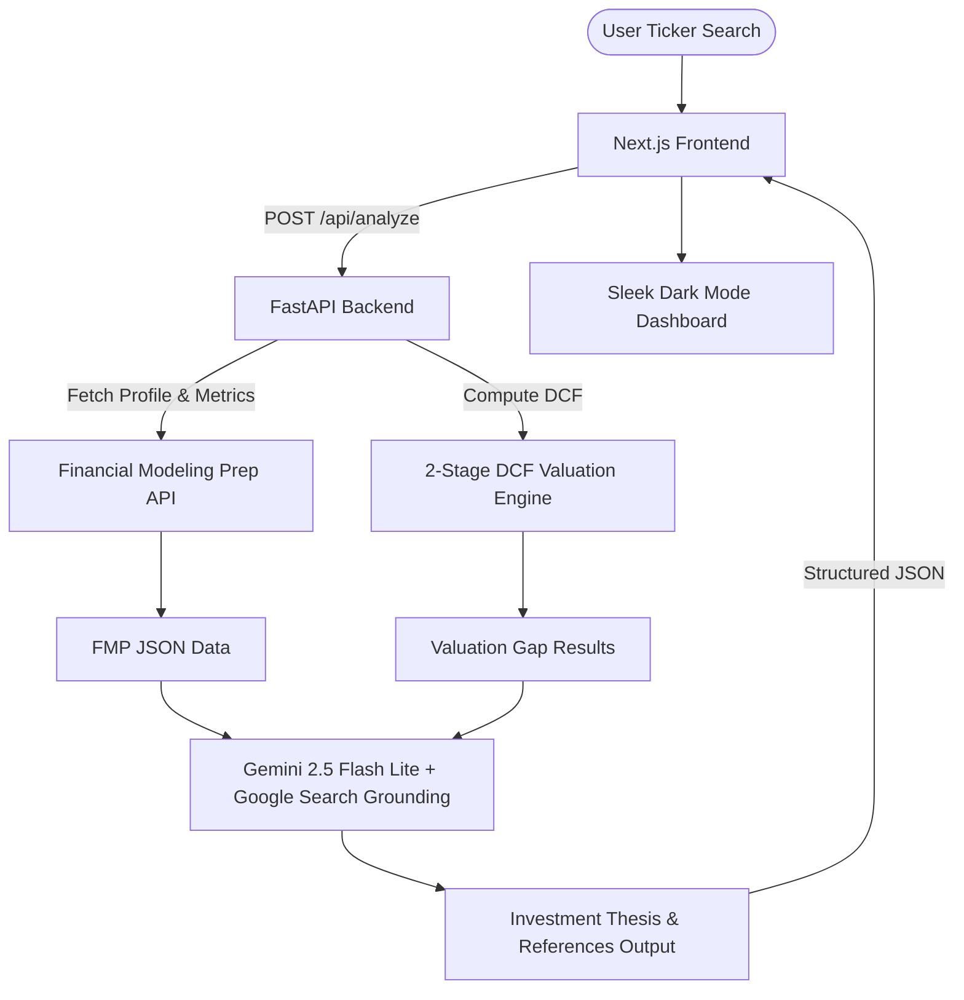

# StockAny AI — Intelligent Equity Valuation & Research Terminal

StockAny AI is a modern, high-fidelity equity research application designed to calculate intrinsic valuations and generate automated, grounded investment theses for public securities. By coupling institutional financial data with generative AI web-grounding, StockAny provides instant, structured research summaries for retail and institutional analysis.

---

## How It Works

StockAny functions via a unified, two-tier architecture comprising a **Python FastAPI backend** and a **Next.js React frontend**.



### 1. Data Retrieval & DCF Valuation Engine (Backend)
- **Financial modeling**: The backend uses the ticker input to fetch real-time stock profiles, trailing-twelve-months (TTM) financial ratios, and the latest annual cash flow statement from the **Financial Modeling Prep (FMP) API**.
- **DCF Calculation**: It uses a built-in mathematical engine to compute the stock's intrinsic value using a **2-Stage Discounted Cash Flow (DCF)** model:
  $$\text{PV}_{\text{Cash Flows}} = \sum_{t=1}^{5} \frac{\text{FCF} \times (1 + g)^t}{(1 + d)^t}$$
  where $g$ represents the growth rate (default: $8\%$) and $d$ is the discount rate ($9\%$). The terminal value is calculated using a terminal growth rate of $2.5\%$ and discounted back to present value.

### 2. Generative AI Web Research
- **Web Search**: The raw financial metrics and DCF calculations, along with the ticker, are passed to **Gemini 2.5 Flash Lite** via **LangChain**, which uses **Tavily Search** to look up recent earnings reports, business developments, regulatory filings, and market risks.
- **Structured Synthesis**: The model synthesizes the search findings and financial formulas into a clean JSON structure, detailing:
  - An overarching **Investment Summary**.
  - A **Recommendation Rationale** explaining why the stock is a **BUY**, **HOLD**, or **SELL**.
  - Structured **Bull & Bear Cases**.
  - Clickable URLs from Tavily's live search results.

### 3. Sleek Immersive Frontend UI
- **Immersive Background**: The landing page features a looping, high-definition stock market visualization video background covered by a soft, transparent black gradient overlay.
- **Glassmorphism & Accents**: Forms and buttons are styled with glassmorphic cards (`bg-neutral-950/70 backdrop-blur-md`) and glowing emerald elements.
- **Inline SVGs**: Custom, vector logos are rendered dynamically for popular stock tickers.
- **Valuation Gap Card**: An elegant progress bar displays a visual comparison between the calculated Intrinsic Value (emerald) and the Current Market Price (rose).
- **Metric Grids**: Core metrics are framed in boxes that automatically adapt their borders based on the stock's performance (e.g., rose borders for negative margin of safety, emerald for positive).

---

## Technology Stack

### Backend
- **Framework**: FastAPI (Python 3.11+)
- **Agent Integration**: LangChain & LangChain Google GenAI SDK
- **Model**: `gemini-2.5-flash-lite`
- **Web Search**: Tavily Search API (via `langchain-tavily`)
- **Data APIs**: Financial Modeling Prep (FMP)

### Frontend
- **Framework**: Next.js 16 (React 19, Turbopack compiler)
- **Styling**: Tailwind CSS v4
- **Typography**: Inter (Google Fonts)
- **Icons & Graphics**: Pure inline SVGs & HTML5 `<video>` autoplay loops

---

## Getting Started

### Prerequisites
You will need two API keys. Create a `.env` file inside the root backend folder (`/app/.env`):
```env
GOOGLE_API_KEY=your_gemini_api_key_here
FMP_API_KEY=your_fmp_api_key_here
```

### Setup & Launch

#### 1. Start the FastAPI Backend
From the root directory:
```bash
# Navigate to the backend directory
cd app

# Install python dependencies (or use virtual environment)
pip install -r requirements.txt

# Start the uvicorn API server
uvicorn main:app --reload
```
The backend server runs at `http://localhost:8000`.

#### 2. Start the Next.js Frontend
In a new terminal, navigate to the `stockany` folder:
```bash
# Install package dependencies
npm install

# Run the Next.js development server
npm run dev
```
Open [http://localhost:3000](http://localhost:3000) in your web browser.

---

## Configuration

By default, the frontend points to `http://localhost:8000`. You can configure a custom API URL by adding an environment variable to the frontend project:

```bash
NEXT_PUBLIC_API_BASE_URL=http://your-custom-backend-domain
```
